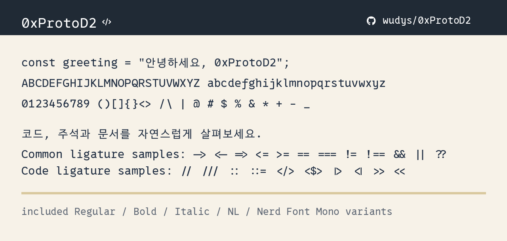

# 0xProtoD2



0xProtoD2는 영문 코드와 한글 주석, 문서를 한 family 안에서 균형 있게 표시하기 위한 프로그래밍 글꼴입니다. fallback font나 secondary font를 지정하기 어려운 환경에서도 [0xProto](https://github.com/0xType/0xProto)의 코드 가독성과 [D2Coding](https://github.com/naver/d2codingfont)의 한글 프로그래밍 글꼴 경험을 함께 사용할 수 있도록 맞췄습니다.

## 특징

- **코드 가독성**: 비슷한 글자를 구분하기 쉬운 형태, 작은 크기에서도 읽기 좋은 여백, 의미와 형태를 과하게 바꾸지 않는 ligature 정책을 따릅니다.
- **자연스러운 한글 표시**: 한글 주석과 문서가 영문 코드와 같은 family 안에서 어색하게 튀지 않도록 폭, 외곽선 크기, 좌우 여백을 조정했습니다.
- **용도별 버전 제공**: Regular, Bold, Italic, No Ligatures, Nerd Font Mono, 웹폰트용 WOFF2 파일을 제공합니다.
- **빌드 설정 제공**: 한글 폭, 외곽선 크기, 좌우 여백을 빌드 시 조정할 수 있습니다.

## 설치

[Releases](https://github.com/wudys/0xProtoD2/releases/latest)에서 원하는 폰트 파일을 내려받아 설치합니다.

| 버전           | 패밀리                        | 제공 파일  | 추천 환경                        |
| -------------- | ----------------------------- | ---------- | -------------------------------- |
| 기본           | `0xProtoD2`                   | TTF, WOFF2 | 코드 에디터, IDE                 |
| No Ligatures   | `0xProtoD2 NL`                | TTF, WOFF2 | ligature를 완전히 끄고 싶은 환경 |
| Nerd Font Mono | `0xProtoD2 NL Nerd Font Mono` | TTF        | 터미널, Vim/Neovim               |

각 버전은 같은 글리프를 가진 `ZxProtoD2` 호환 family로도 함께 제공합니다. 릴리스 파일명에는 공백 대신 하이픈이 들어갈 수 있습니다.
기본, NL, Nerd Font Mono family는 Regular / Bold / Italic 스타일을 제공합니다.
`Italic` 스타일은 0xProto의 Italic 영문 글리프와 Script Variant를 포함합니다. D2Coding은 별도 Italic 한글 글리프를 제공하지 않으므로, Italic 산출물의 한글은 D2Coding Regular 글리프를 사용합니다.

## 빌드

### 요구사항

- Python 3.7+
- FontForge
- FontForge Python 바인딩
- zip
- Nerd Font Mono 패치용 인터넷 연결

Ubuntu/Debian:

```bash
sudo apt-get update
sudo apt-get install fontforge python3-fontforge zip
```

macOS:

```bash
brew install fontforge
```

빌드:

```bash
python3 scripts/build.py build
```

테스트:

```bash
python3 scripts/test_font_build.py
```

미리보기 생성:

미리보기 생성에는 Pillow와 fontTools가 추가로 필요합니다.

```bash
python3 -m pip install pillow fonttools
```

```bash
python3 scripts/build.py preview
```

`preview/balance-comparison.png`에는 현재 설정값과 D2Coding/0xProtoD2 렌더링 비교가 함께 표시됩니다.
`preview/metrics.json`에는 실제 advance width 측정값이 저장됩니다.

## 커스텀 설정

한글 폭과 외곽선 크기는 `scripts/font_settings.py` 또는 같은 이름의 환경 변수로 조정할 수 있습니다.
기본 family와 `NL` family는 코드 에디터에서 D2Coding fallback을 함께 쓰는 느낌에 맞추고,
`NL Nerd Font Mono` family는 터미널의 2칸 한글 셀을 유지하도록 별도 설정을 사용합니다.

| 설정                            |  기본값 | 설명                                                             |
| ------------------------------- | ------: | ---------------------------------------------------------------- |
| `HANGUL_WIDTH_RATIO`            | `1.613` | 기본/NL 한글 advance width를 영문 폭의 몇 배로 둘지 정합니다.    |
| `HANGUL_GLYPH_SCALE`            |  `1.09` | 기본/NL advance width는 유지한 채 한글 외곽선 크기만 조정합니다. |
| `HANGUL_SIDE_BEARING`           |   `100` | 기본/NL 한글 셀 안쪽 좌우 여백을 조정합니다.                     |
| `HANGUL_NERD_MONO_WIDTH_RATIO`  |   `2.0` | Nerd Font Mono 한글 advance width를 영문 2칸으로 맞춥니다.       |
| `HANGUL_NERD_MONO_GLYPH_SCALE`  |  `0.94` | Nerd Font Mono 한글 외곽선 크기를 조정합니다.                    |
| `HANGUL_NERD_MONO_SIDE_BEARING` |    `90` | Nerd Font Mono 한글 셀 안쪽 좌우 여백을 조정합니다.              |

## FAQ

### 폰트 이름이 왜 두 개인가요?

`0xProtoD2`와 `ZxProtoD2`는 같은 글리프를 가진 같은 폰트입니다. `0xProto` 이름은 OpenType 표준상 문제가 없지만, 일부 애플리케이션/플랫폼 호환성을 위해 `ZxProtoD2`도 함께 제공합니다. [관련 내용](https://github.com/0xType/0xProto/pull/112)

## 라이선스

이 프로젝트는 [LICENSE](LICENSE)을 따릅니다.

- [0xProto](https://github.com/0xType/0xProto/blob/main/LICENSE): SIL OFL 1.1
- [D2Coding](https://github.com/naver/d2codingfont/wiki/Open-Font-License): SIL OFL 1.1
- [Nerd Fonts Patcher](https://github.com/ryanoasis/nerd-fonts/blob/master/LICENSE): MIT License
- Forked from [FiraD2](https://github.com/partrita/FiraD2/blob/main/LICENSE): SIL OFL 1.1

각 라이선스 고지는 유지해야 합니다.
